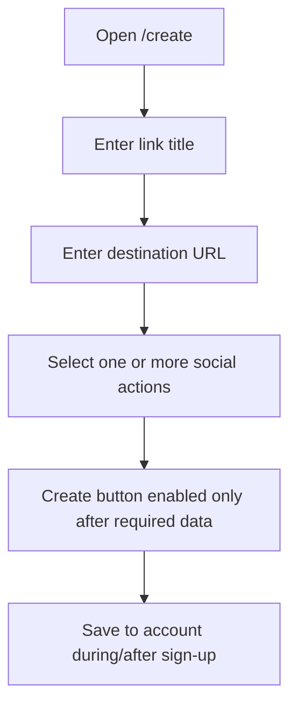
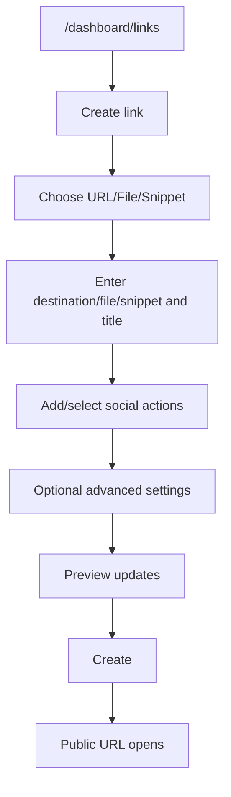

# Create Link Flows

## Public Pre-Signup Flow

Status: Observed

Observed fields and controls:

- Link title: required input, placeholder `e.g. Free script pack`.
- Destination URL: required input, placeholder `https://...`.
- Actions: section says "Pick one or more steps your audience must complete to unlock the destination."
- Row controls: Select action, delete, Add action.
- Create is disabled when title and destination are filled but no action is selected.

Evidence:

- `evidence/screenshots/create-link/public-create-initial.png`
- `evidence/screenshots/create-link/public-create-filled-no-action.png`
- `evidence/screenshots/create-link/public-create-lazy-after-scroll.png`
- `evidence/notes/interaction-create-public.json`

## Lazy-Loaded Page Content

Status: Observed

The `/create` route renders the create form above a long landing page. After scrolling, additional demo sections become visible, including completed action states, analytics counters, email capture examples, link-in-bio marketing, and testimonials.

Evidence:

- `evidence/notes/public-create-lazy-after-scroll.json`
- `evidence/screenshots/create-link/public-create-lazy-after-scroll.png`

## Authenticated Create Flow

Status: Observed and partially tested

Observed creator flow:

URL social-gated creation was completed:

- Type: URL.
- Destination: test `example.com` URL.
- Title: generated Codex test title.
- Action: recent Subscribe to channel action.
- Request: `POST /social-unlocks`, status 201.
- Public slug: `codex-url-demo-1783760537194-j2r4b`.

Evidence:

- `evidence/screenshots/create-link/auth-create-url-initial.png`
- `evidence/screenshots/create-link/auth-create-url-filled-action.png`
- `evidence/screenshots/create-link/auth-create-url-submit-result.png`
- `evidence/network/links/auth-create-url-submit-result.json`

File and snippet were inspected but not published:

- File toggle shows Select file, title, social actions, preview.
- Snippet toggle shows Select snippet, title, social actions, preview.
- Snippet creation was not completed because the flow expects a selectable snippet entity.
- File creation was not completed to avoid publishing existing account files.

Evidence:

- `evidence/screenshots/create-link/auth-create-file-toggle-exact.png`
- `evidence/screenshots/create-link/auth-create-snippet-toggle-exact.png`

## Validation

Status: Observed for incomplete public form

Create remains disabled until action requirements are satisfied. Detailed URL validation messages were not observed because action selection could not be completed safely in automation.
