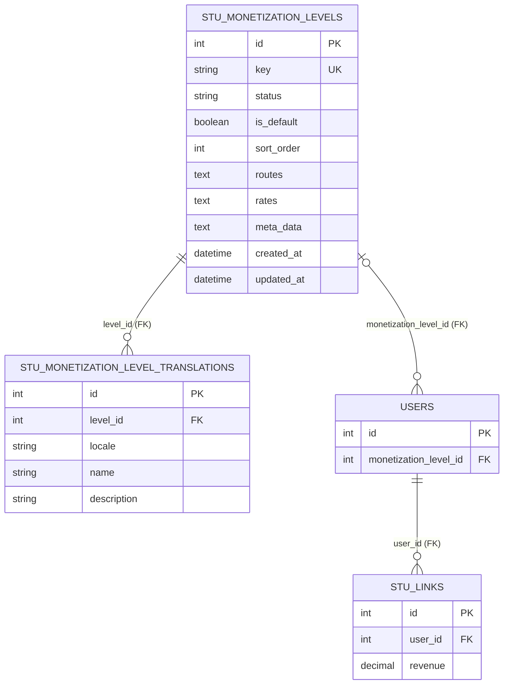
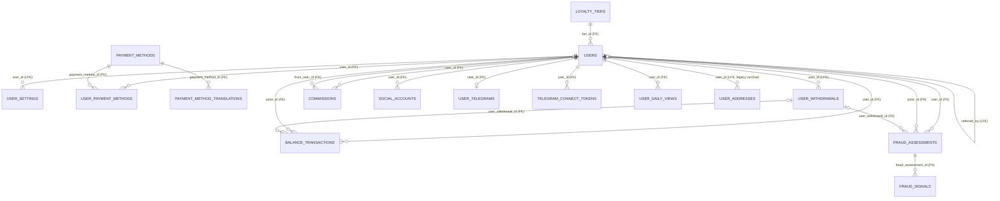
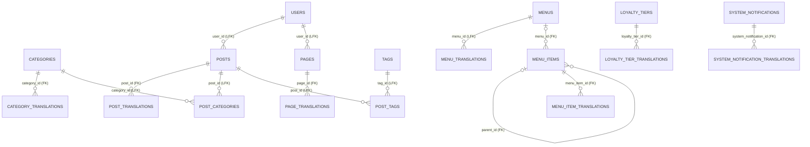
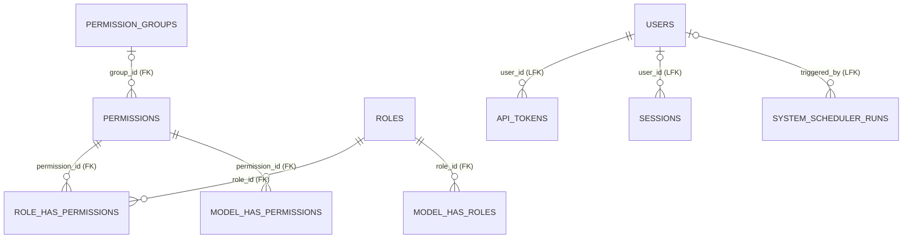

# Link4Sub database ERD và data dictionary

Tài liệu này dùng để chuyển schema từ Laravel sang NestJS. Nguồn đối chiếu là database MySQL local `link4sub`, migration và Eloquent model của dự án tại ngày **2026-07-15**.

## 1. Phạm vi và quy ước

- Database đang chạy trên **MySQL 8.4.5**, charset mặc định `utf8mb4`, collation mặc định `utf8mb4_unicode_ci`.
- Database hiện có **76 bảng vật lý**. Schema mà code mới hướng tới có **75 bảng**, vì `withdrawal_status_histories` đang chờ bị xóa bởi migration `2026_07_11_010000_drop_withdrawal_status_histories_table`.
- Migration ledger đang bị lệch schema: bốn migration `add_avatar_to_users`, `create_user_agents`, `create_social_accounts`, `make_users_password_nullable` báo `Pending` dù cột/bảng tương ứng đã tồn tại. Không chạy mù `php artisan migrate`; cần reconcile bảng `migrations` hoặc viết migration idempotent trước.
- `PK`: primary key; `FK`: foreign key được MySQL thực thi; `LFK`: quan hệ logic mà code sử dụng nhưng database chưa có foreign key; `AI`: auto increment; `UQ`: unique index; `NULL`: cho phép null.
- Kiểu được ghi đúng theo schema MySQL hiện tại. `timestamp NULL` và `datetime NULL` không nên tự động đổi thành `NOT NULL` khi port.
- Các cột tiền/tỷ lệ có độ chính xác cao phải map sang TypeORM `decimal` và giữ dưới dạng `string` hoặc dùng decimal library; không ép sang JavaScript `number`.
- Các cột `longtext` chứa cấu hình/JSON cũ vẫn là text, không được tự động đổi sang `json` nếu chưa làm migration dữ liệu.
- Quan hệ ghi trong Mermaid gồm cả FK thật và LFK. Danh sách FK thật nằm ở mục 3.

## 2. ERD theo domain

### 2.0. Monetization schema của dự án NestJS hiện tại

Phần này mô tả schema mới đã được triển khai cho tài khoản và `stu_links`. Nó thay thế cách
tách `levels`, `stu_level_rates` và `stu_level_translations` của hệ Laravel cũ
bằng hai bảng cấu hình tập trung:

- `routes`: JSON array chứa rule chuyển hướng theo quốc gia, thiết bị, trình
  duyệt, priority và weight. Ba điều kiện dùng `countryMode`, `deviceMode` và
  `browserMode` với giá trị `include` hoặc `exclude`. Ví dụ `include + VN` chỉ
  khớp Việt Nam, `exclude + mobile` loại traffic mobile và `exclude + safari`
  loại Safari. Các điều kiện trong cùng route được kết hợp bằng AND. Dữ liệu cũ
  thiếu mode được đọc như `include`; không cho phép `exclude` đi cùng
  `ALL`/`any`.
- `rates`: JSON array chứa base CPM, currency và daily limit theo tổ hợp quốc
  gia/thiết bị.
- `meta_data`: JSON object có version, `profitBps`, `stepCount` và mật độ bốn
  định dạng quảng cáo.
- Tên và mô tả được tách sang bảng translation với unique
  `(level_id, locale)`. UI quản trị hiện yêu cầu tối thiểu `vi` và `en`.
- Frontend chọn bản dịch theo locale hiện tại của `next-intl`, sau đó fallback
  về language code, `vi`, `en` và cuối cùng là `key`. Khi sửa `vi`/`en`, các
  locale bổ sung chưa có tab riêng vẫn được giữ nguyên trong payload.
- Chỉ có một level mặc định theo quy tắc service. Level mặc định phải `active`.
- Mỗi user chỉ lựa chọn một level cho toàn bộ link thông qua
  `users.monetization_level_id`. Giá trị `NULL` kế thừa level `is_default`.
- `stu_links` không còn lưu level riêng và không thể chọn level khác nhau giữa
  các link của cùng một user.
- Không thể xóa level mặc định hoặc level đang được user lựa chọn.
- Route target URL là URL của website quảng cáo trung gian. API public không
  trả toàn bộ cấu hình route, chỉ trả URL route đã được resolver chọn.
- Khi public URL được mở, Next.js chuyển country header, IP và User-Agent sang
  NestJS. Resolver lấy level active của user hoặc level mặc định, lọc các route
  `enabled` thỏa đồng thời country/device/browser, chọn priority lớn nhất và
  phân phối ổn định theo `weight` trong nhóm cùng priority.
- `destination_url` luôn là đích cuối của link và không bị resolver ghi đè.
  Khi có route phù hợp, response visit trả thêm `monetizationRedirectUrl`.
  Next.js chuyển visitor đến URL quảng cáo này và gắn `slug` cùng `dataUrl`.
- Website quảng cáo gọi `dataUrl` (`GET /api/public/links/:slug` trên Next.js)
  để lấy dữ liệu link, hiển thị quảng cáo và tiếp tục visitor tới
  `destinationUrl`. Nếu không có route phù hợp, trang unlock hiện tại được render
  như bình thường.

### 2.1. User, thanh toán, rút tiền và chống gian lận

### 2.2. Short link, note link và thống kê truy cập

```mermaid
erDiagram
    USERS ||--o{ STU_LINKS : "user_id (LFK)"
    LEVELS ||--o{ STU_LINKS : "level_id (LFK)"
    LEVELS ||--o{ STU_LEVEL_RATES : "level_id (LFK)"
    LEVELS ||--o{ STU_LEVEL_TRANSLATIONS : "level_id (LFK)"
    STU_LINKS ||--o{ STU_ACCESS_LOGS : "link_id (LFK)"
    USERS ||--o{ STU_ACCESS_LOGS : "user_id (LFK)"
    LEVELS o|--o{ STU_ACCESS_LOGS : "level_id (LFK)"
    USER_AGENTS ||--o{ STU_ACCESS_LOGS : "hash = agent_hash (LFK)"
    USERS ||--o{ STU_DAILY_STATS : "user_id (FK)"
    STU_LINKS ||--o{ STU_LINK_ACCESSES : "link_id (LFK, legacy)"
    STU_LINKS ||--o{ STU_LINK_CLICKS : "link_id (LFK, legacy)"

    USERS ||--o{ NOTE_LINKS : "user_id (LFK)"
    NOTE_LEVELS ||--o{ NOTE_LINKS : "level_id (LFK)"
    NOTE_LEVELS ||--o{ NOTE_LEVEL_RATES : "level_id (LFK)"
    NOTE_LEVELS ||--o{ NOTE_LEVEL_TRANSLATIONS : "level_id (LFK)"
    NOTE_LINKS ||--o{ NOTE_ACCESS_LOGS : "link_id (LFK)"
    USERS ||--o{ NOTE_ACCESS_LOGS : "user_id (LFK)"
    NOTE_LEVELS o|--o{ NOTE_ACCESS_LOGS : "level_id (LFK)"
    USER_AGENTS ||--o{ NOTE_ACCESS_LOGS : "hash = agent_hash (LFK)"
    USERS ||--o{ NOTE_DAILY_STATS : "user_id (FK)"
    NOTE_LINKS ||--o{ NOTE_LINK_ACCESSES : "link_id (LFK, legacy)"
    NOTE_LINKS ||--o{ NOTE_STATISTICS : "link_id (LFK, legacy)"

    USERS ||--o{ INTERNAL_LINKS : "user_id (LFK)"
    LEVELS ||--o{ INTERNAL_LINKS : "level_id (LFK)"
    INTERNAL_LINKS ||--o{ INTERNAL_LINK_ACCESSES : "link_id (LFK)"
    USERS ||--o{ INTERNAL_LINK_ACCESSES : "user_id (LFK)"
    USER_AGENTS ||--o{ INTERNAL_LINK_ACCESSES : "hash = agent_hash (LFK)"
```

### 2.3. CMS, menu và localization

### 2.4. Phân quyền, token và vận hành hệ thống

`model_has_roles`, `model_has_permissions`, `personal_access_tokens` và `meta_boxes` là quan hệ polymorphic; `model_type`, `tokenable_type`, `reference_type` chứa tên class/type thay vì FK vật lý.

## 3. Foreign key được MySQL thực thi

Chỉ các quan hệ dưới đây có constraint thật (không tính hai FK của bảng deprecated `withdrawal_status_histories`). Các quan hệ còn lại trong ERD phải được giữ bằng application logic hoặc bổ sung FK sau khi đã làm sạch dữ liệu và đồng nhất kiểu cột.

| Bảng.cột                                                  | Tham chiếu                | ON DELETE | ON UPDATE |
| --------------------------------------------------------- | ------------------------- | --------: | --------: |
| `balance_transactions.user_id`                            | `users.id`                |   CASCADE | NO ACTION |
| `balance_transactions.user_withdrawal_id`                 | `user_withdrawals.id`     |  SET NULL | NO ACTION |
| `balance_transactions.actor_id`                           | `users.id`                |  SET NULL | NO ACTION |
| `category_translations.category_id`                       | `categories.id`           |   CASCADE | NO ACTION |
| `commissions.user_id`                                     | `users.id`                |   CASCADE |   CASCADE |
| `commissions.from_user_id`                                | `users.id`                |   CASCADE |   CASCADE |
| `fraud_assessments.user_id`                               | `users.id`                |   CASCADE | NO ACTION |
| `fraud_assessments.user_withdrawal_id`                    | `user_withdrawals.id`     |   CASCADE | NO ACTION |
| `fraud_assessments.actor_id`                              | `users.id`                |  SET NULL | NO ACTION |
| `fraud_signals.fraud_assessment_id`                       | `fraud_assessments.id`    |   CASCADE | NO ACTION |
| `loyalty_tier_translations.loyalty_tier_id`               | `loyalty_tiers.id`        |   CASCADE | NO ACTION |
| `menu_item_translations.menu_item_id`                     | `menu_items.id`           |   CASCADE | NO ACTION |
| `menu_items.menu_id`                                      | `menus.id`                |   CASCADE | NO ACTION |
| `menu_items.parent_id`                                    | `menu_items.id`           |   CASCADE | NO ACTION |
| `model_has_permissions.permission_id`                     | `permissions.id`          |   CASCADE | NO ACTION |
| `model_has_roles.role_id`                                 | `roles.id`                |   CASCADE | NO ACTION |
| `note_daily_stats.user_id`                                | `users.id`                |   CASCADE | NO ACTION |
| `page_translations.page_id`                               | `pages.id`                |   CASCADE | NO ACTION |
| `payment_method_translations.payment_method_id`           | `payment_methods.id`      | NO ACTION | NO ACTION |
| `permissions.group_id`                                    | `permission_groups.id`    |   CASCADE | NO ACTION |
| `post_translations.post_id`                               | `posts.id`                |   CASCADE | NO ACTION |
| `role_has_permissions.permission_id`                      | `permissions.id`          |   CASCADE | NO ACTION |
| `role_has_permissions.role_id`                            | `roles.id`                |   CASCADE | NO ACTION |
| `social_accounts.user_id`                                 | `users.id`                |   CASCADE | NO ACTION |
| `stu_daily_stats.user_id`                                 | `users.id`                |   CASCADE | NO ACTION |
| `system_notification_translations.system_notification_id` | `system_notifications.id` |   CASCADE | NO ACTION |
| `telegram_connect_tokens.user_id`                         | `users.id`                |   CASCADE | NO ACTION |
| `user_daily_views.user_id`                                | `users.id`                |   CASCADE | NO ACTION |
| `user_payment_methods.user_id`                            | `users.id`                |   CASCADE | NO ACTION |
| `user_payment_methods.payment_method_id`                  | `payment_methods.id`      |   CASCADE | NO ACTION |
| `user_settings.user_id`                                   | `users.id`                | NO ACTION | NO ACTION |
| `user_telegrams.user_id`                                  | `users.id`                |   CASCADE | NO ACTION |
| `users.tier_id`                                           | `loyalty_tiers.id`        |  SET NULL | NO ACTION |

Schema hiện tại vô tình có **hai constraint trùng nhau** cùng giữ `user_payment_methods.payment_method_id -> payment_methods.id`. Khi dựng migration NestJS chỉ tạo một FK.

## 4. Data dictionary đầy đủ

Ký hiệu `=x` là default. Nếu không ghi `NULL` thì cột là `NOT NULL`. `created_at/updated_at` chỉ được viết gọn khi cả hai có cùng kiểu và nullability.

### 4.1. User, hồ sơ và xác thực

#### `users`

Tài khoản trung tâm của hệ thống.

- Cột: `id bigint unsigned PK AI`; `name varchar(255)`; `email varchar(255) UQ`; `email_verified_at timestamp NULL`; `password varchar(255) NULL`; `avatar varchar(255) NULL`; `remember_token varchar(100) NULL`; `balance decimal(20,10)=0`; `held_balance decimal(20,10)=0`; `referred_by bigint=0 LFK -> users.id`; `tier_id bigint unsigned NULL FK -> loyalty_tiers.id`; `status enum('active','inactive','suspended')='active'`; `created_at timestamp NULL`; `updated_at timestamp NULL`.
- Index: UQ `email`; index `referred_by`; index/FK `tier_id`.
- Lưu ý: `referred_by=0` biểu diễn không có người giới thiệu, không phải `NULL`. Cột này signed trong khi `users.id` unsigned.

#### `social_accounts`

Tài khoản OAuth/social gắn với user.

- Cột: `id bigint unsigned PK AI`; `user_id bigint unsigned FK`; `provider varchar(255)`; `provider_id varchar(255)`; `token text NULL`; `created_at timestamp NULL`; `updated_at timestamp NULL`.
- Index: UQ ghép `(provider, provider_id)`; FK `user_id -> users.id ON DELETE CASCADE`.

#### `user_telegrams`

Thông tin Telegram đã liên kết.

- Cột: `id bigint unsigned PK AI`; `user_id bigint unsigned FK`; `telegram_id bigint unsigned UQ`; `telegram_username varchar(255) NULL`; `telegram_first_name varchar(255) NULL`; `telegram_last_name varchar(255) NULL`; `telegram_photo_url varchar(255) NULL`; `telegram_connected_at timestamp NULL`; `created_at timestamp NULL`; `updated_at timestamp NULL`.
- Lưu ý: database chưa đặt UQ cho `user_id`, dù model Laravel dùng quan hệ `hasOne`.

#### `telegram_connect_tokens`

Token một lần để nối tài khoản Telegram.

- Cột: `id bigint unsigned PK AI`; `user_id bigint unsigned FK`; `token_hash varchar(128) UQ`; `expires_at timestamp`; `used_at timestamp NULL`; `created_at timestamp NULL`; `updated_at timestamp NULL`.
- Index: `(user_id, expires_at)`.

#### `user_addresses`

Bảng địa chỉ legacy, hiện không có Eloquent model riêng.

- Cột: `id bigint PK AI`; `user_id varchar(11) UQ LFK -> users.id`; `fullname varchar(200) NULL`; `number_phone varchar(15) NULL`; `address_1 varchar(200) NULL`; `address_2 varchar(200) NULL`; `region varchar(100) NULL`; `city varchar(100) NULL`; `country varchar(200) NULL`; `zipcode varchar(10) NULL`.
- Lưu ý: `user_id` là chuỗi, không đồng kiểu với `users.id`; cần chuẩn hóa trước khi thêm FK.

#### `user_settings`

Cấu hình key/value theo user.

- Cột: `id bigint unsigned PK AI`; `user_id bigint unsigned FK`; `key varchar(255)`; `value text NULL`; `created_at timestamp NULL DEFAULT CURRENT_TIMESTAMP`; `updated_at timestamp NULL DEFAULT CURRENT_TIMESTAMP ON UPDATE CURRENT_TIMESTAMP`.
- Index: index đơn `user_id`; không có UQ `(user_id, key)`, vì vậy có thể có key trùng.

#### `password_reset_tokens`

- Cột: `email varchar(255) PK`; `token varchar(255)`; `created_at timestamp NULL`.

#### `personal_access_tokens`

Token polymorphic theo chuẩn Laravel Sanctum.

- Cột: `id bigint unsigned PK AI`; `tokenable_type varchar(255)`; `tokenable_id bigint unsigned`; `name varchar(255)`; `token varchar(64) UQ`; `abilities text NULL`; `last_used_at timestamp NULL`; `expires_at timestamp NULL`; `created_at timestamp NULL`; `updated_at timestamp NULL`.
- Index: `(tokenable_type, tokenable_id)`.

#### `api_tokens`

Token API nghiệp vụ của Link4Sub, khác với Sanctum token.

- Cột: `id bigint unsigned PK AI`; `user_id bigint unsigned LFK -> users.id`; `level_id bigint unsigned LFK -> levels.id hoặc note_levels.id`; `name varchar(255)`; `description varchar(255) NULL`; `token varchar(255)`; `type int`; `status tinyint=1`; `created_at timestamp`; `updated_at timestamp`.
- Lưu ý: không có UQ cho `token`; `type` quyết định `level_id` thuộc hệ STU hay NOTE. Quan hệ `user()` trong model hiện có dấu hiệu map nhầm local key, nên NestJS nên dùng rõ `user_id -> users.id`.

#### `sessions`

- Cột: `id varchar(255) PK`; `user_id bigint unsigned NULL LFK -> users.id`; `ip_address varchar(45) NULL`; `user_agent text NULL`; `payload longtext`; `last_activity int`.
- Index: `user_id`, `last_activity`.

### 4.2. Loyalty, thanh toán và rút tiền

#### `loyalty_tiers`

- Cột: `id bigint unsigned PK AI`; `required_views int unsigned`; `bonus_cpm decimal(5,2)=0`; `sort_order int unsigned=0`; `created_at timestamp NULL`; `updated_at timestamp NULL`.

#### `loyalty_tier_translations`

- Cột: `id bigint unsigned PK AI`; `loyalty_tier_id bigint unsigned FK`; `locale varchar(10)`; `name varchar(255)`; `description varchar(400) NULL`; `perks text NULL`; `created_at timestamp NULL`; `updated_at timestamp NULL`.
- Index: UQ `(loyalty_tier_id, locale)`; index `locale`.

#### `payment_methods`

- Cột: `id bigint unsigned PK AI`; `withdraw_fee decimal(10,2)=0`; `min_withdraw_amount decimal(10,2)=0`; `status varchar(255)`; `created_at timestamp NULL DEFAULT CURRENT_TIMESTAMP`; `updated_at timestamp NULL DEFAULT CURRENT_TIMESTAMP ON UPDATE CURRENT_TIMESTAMP`.

#### `payment_method_translations`

- Cột: `id bigint unsigned PK AI`; `locale varchar(10)`; `payment_method_id bigint unsigned FK`; `name varchar(255) NULL`; `fields longtext NULL`.
- Index: UQ `(payment_method_id, locale)`; index `locale`; FK không có cascade delete.
- `fields` thường chứa cấu hình field động nhưng schema vật lý vẫn là `longtext`.

#### `user_payment_methods`

Thông tin tài khoản nhận tiền của user theo phương thức thanh toán.

- Cột: `id bigint unsigned PK AI`; `user_id bigint unsigned FK`; `payment_method_id bigint unsigned FK`; `details longtext`; `created_at timestamp NULL DEFAULT CURRENT_TIMESTAMP`; `updated_at timestamp NULL DEFAULT CURRENT_TIMESTAMP ON UPDATE CURRENT_TIMESTAMP`.
- Index: index `user_id`, index `payment_method_id`; không có UQ `(user_id, payment_method_id)`.

#### `user_withdrawals`

Yêu cầu rút tiền và trạng thái giữ/chi tiền.

- Cột: `id bigint PK AI`; `amount decimal(20,10)`; `costs decimal(10,2)=0`; `type tinyint(1)=0`; `user_id bigint=0 LFK -> users.id`; `status varchar(255)='pending'`; `created_at datetime`; `updated_at timestamp NULL`; `note varchar(400) NULL`; `payment_method varchar(50) NULL`; `payment_details longtext NULL`; `payment_fingerprint char(64) NULL`; `payment_account_number varchar(100) NULL`; `payment_account_name varchar(100) NULL`; `payment_bank_name varchar(50) NULL`; `paid_at datetime NULL`; `fee_amount decimal(20,10)=0`; `net_amount decimal(20,10)=0`; `funds_status varchar(30)='held'`; `idempotency_key varchar(64) NULL UQ`; `payout_reference varchar(191) NULL`; `status_reason text NULL`.
- Index: `(status, created_at)`; `(user_id, funds_status)`; `payment_fingerprint`; UQ `idempotency_key`.
- Giá trị nghiệp vụ hiện hành: `status` thuộc `pending | approved | on_hold | completed | rejected`; `funds_status` thuộc `held | settled | released` (dữ liệu chuyển đổi cũ có thể có `legacy_closed`).
- `fee_amount = amount * costs / 100`; `net_amount = amount - fee_amount`. Giữ precision 10 chữ số thập phân.

#### `balance_transactions`

Sổ cái bất biến ghi biến động số dư khả dụng và số dư đang giữ.

- Cột: `id bigint unsigned PK AI`; `user_id bigint unsigned FK`; `user_withdrawal_id bigint NULL FK`; `actor_id bigint unsigned NULL FK -> users.id`; `type varchar(40)`; `available_delta decimal(20,10)=0`; `held_delta decimal(20,10)=0`; `available_balance decimal(20,10)`; `held_balance decimal(20,10)`; `reference varchar(191) UQ`; `metadata json NULL`; `created_at timestamp DEFAULT CURRENT_TIMESTAMP`.
- Index: `(user_id, created_at)`; index `user_withdrawal_id`; index `actor_id`.
- Không có `updated_at`; record nên được coi là append-only.
- `type` hiện dùng: `withdrawal_hold`, `withdrawal_release`, `withdrawal_settlement`, `referral_commission`, `admin_credit`, `admin_debit`.

#### `commissions`

Hoa hồng giới thiệu.

- Cột: `id bigint unsigned PK AI`; `user_id bigint unsigned FK` (người nhận); `from_user_id bigint unsigned FK` (người tạo doanh thu); `amount decimal(12,2)`; `rate decimal(5,2)`; `commissionable_type varchar(255)`; `commissionable_id bigint`; `note varchar(255)`; `created_at timestamp`; `updated_at timestamp`.
- `commissionable_type + commissionable_id` là quan hệ polymorphic logic, chưa có composite index.

#### `fraud_assessments`

Kết quả chấm điểm gian lận của user hoặc một yêu cầu rút tiền.

- Cột: `id bigint unsigned PK AI`; `user_id bigint unsigned FK`; `user_withdrawal_id bigint NULL FK`; `actor_id bigint unsigned NULL FK -> users.id`; `score tinyint unsigned=0`; `level varchar(20)`; `rule_version varchar(30)`; `window_started_at datetime`; `assessed_at datetime`; `summary json`; `created_at timestamp NULL`; `updated_at timestamp NULL`.
- Index: `(user_id, assessed_at)`; `(user_withdrawal_id, assessed_at)`; `actor_id`.
- `level` hiện dùng: `low`, `review`, `high`, `critical`.

#### `fraud_signals`

Các tín hiệu chi tiết tạo nên một fraud assessment.

- Cột: `id bigint unsigned PK AI`; `fraud_assessment_id bigint unsigned FK`; `code varchar(60)`; `severity varchar(20)`; `score tinyint unsigned`; `title varchar(191)`; `description text`; `evidence json NULL`; `created_at timestamp DEFAULT CURRENT_TIMESTAMP`.
- Index: `(fraud_assessment_id, score)`; `code`. Không có `updated_at`.

### 4.3. STU short links và analytics

#### `levels`

Cấp/rule xử lý link STU.

- Cột: `id bigint PK AI`; `pageload_config text`; `test_link text NULL`; `config longtext NULL`; `status varchar(50)='draft'`; `created_at datetime`; `updated_at datetime`.
- `pageload_config` và `config` là text cấu hình, không phải MySQL JSON.

#### `stu_level_translations`

- Cột: `id bigint PK AI`; `locale varchar(10)`; `level_id bigint unsigned LFK -> levels.id`; `name varchar(255) NULL`; `description varchar(400) NULL`.
- Index: UQ `(level_id, locale)`; index `locale`; index `level_id`.
- Không có timestamps; `level_id` unsigned nhưng `levels.id` signed.

#### `stu_level_rates`

Rate và daily limit theo quốc gia của một STU level.

- Cột: `id bigint unsigned PK AI`; `level_id bigint unsigned LFK -> levels.id`; `country_code varchar(10)`; `rate longtext NULL`; `daily_limit longtext NULL`.
- Index: `country_code`; không có UQ `(level_id, country_code)`.

#### `stu_links`

Short link chính của hệ STU.

- Cột: `id bigint unsigned PK AI`; `user_id bigint unsigned LFK -> users.id`; `alias varchar(50)`; `data text NULL`; `source_type int unsigned=1`; `deleted_at datetime NULL`; `created_at datetime`; `updated_at datetime`; `status text`; `level_id int LFK -> levels.id`; `views int unsigned=0`; `revenue decimal(15,5)=0`.
- Index: `alias` không unique; `user_id`. Laravel dùng soft delete qua `deleted_at`.

#### `stu_access_logs`

Log truy cập STU mới, khối lượng lớn; đây là nguồn analytics chính thay cho bảng access legacy.

- Cột: `id bigint unsigned PK AI`; `link_id bigint unsigned LFK -> stu_links.id`; `user_id bigint unsigned LFK -> users.id`; `level_id bigint unsigned NULL LFK -> levels.id`; `visitor_identifier varchar(255) NULL`; `agent_hash char(32) LFK -> user_agents.hash`; `ip_address varchar(45)`; `country varchar(10)='UNK'`; `device tinyint unsigned=2`; `referrer text NULL`; `revenue decimal(10,6)=0`; `is_earn tinyint unsigned=0`; `detection_mask int unsigned=0`; `reject_reason_mask int unsigned=0`; `created_at datetime`.
- Index: `link_id`; `user_id`; `level_id`; `agent_hash`; `created_at`; `(link_id, created_at)`; `(user_id, created_at)`; `(ip_address, created_at)`.
- Không có FK vật lý để tối ưu tốc độ ghi log. Không có `updated_at`.

#### `stu_daily_stats`

Số liệu STU tổng hợp theo user/ngày.

- Cột: `id bigint unsigned PK AI`; `user_id bigint unsigned FK`; `date date`; `views int unsigned=0`; `revenue decimal(20,10) unsigned=0`; `created_at timestamp NULL`; `updated_at timestamp NULL`.
- Index: `date`; FK `user_id`. Không có UQ `(user_id, date)`, nên job tổng hợp phải tự bảo đảm không trùng.

#### `stu_link_accesses` (legacy)

Log truy cập STU thế hệ cũ, vẫn còn dữ liệu và được một số model cũ (`StuAnalysis`) map tới.

- Cột: `id bigint unsigned PK AI`; `user_id bigint unsigned NULL LFK`; `level_id bigint unsigned LFK`; `link_id bigint unsigned LFK`; `is_earn tinyint(1)=0`; `revenue decimal(10,5)`; `created_at datetime`; `ip_address varchar(50)`; `agent_hash varchar(255) NULL`; `referrer varchar(255) NULL`; `country varchar(255) NULL`; `detection_mask int NULL`; `reject_reason_mask int NULL`.
- Index: `user_id`; `level_id`; `link_id`; `created_at`; `(created_at, user_id)`.

#### `stu_link_clicks` (legacy)

- Cột: `id int PK AI`; `link_id bigint LFK -> stu_links.id`; `revenue decimal(10,5)`; `date date`; `clicks int`.
- Index: `link_id`, `date`.

### 4.4. NOTE links và analytics

#### `note_levels`

Cấp/rule xử lý NOTE link.

- Cột: `id bigint PK AI`; `pageload_config text`; `test_link text NULL`; `minimum_pages int=1`; `config longtext NULL`; `status varchar(255)='1'`; `created_at datetime`; `updated_at datetime`.

#### `note_level_translations`

- Cột: `id bigint PK AI`; `locale varchar(10)`; `level_id bigint unsigned LFK -> note_levels.id`; `name varchar(255) NULL`; `description varchar(400) NULL`.
- Index: UQ `(level_id, locale)`; index `locale`; index `level_id`. Không có timestamps.

#### `note_level_rates`

- Cột: `id bigint unsigned PK AI`; `level_id bigint unsigned LFK -> note_levels.id`; `country_code varchar(10)`; `rate longtext NULL`; `daily_limit longtext NULL`.
- Index: `country_code`; không có UQ `(level_id, country_code)`.

#### `note_links`

Trang note có nội dung, có thể bảo vệ bằng mật khẩu và hết hạn.

- Cột: `id int PK AI`; `alias varchar(255)`; `title varchar(255) NULL`; `content text`; `password text NULL`; `style int unsigned=1`; `level_id int=1 LFK -> note_levels.id`; `views int unsigned=0`; `revenue decimal(15,5)=0`; `user_id int LFK -> users.id`; `deleted_at datetime NULL`; `created_at timestamp`; `updated_at timestamp NULL`; `expired_at timestamp NULL`; `status varchar(255)='active'`.
- Không có unique/index cho `alias`; Laravel dùng soft delete qua `deleted_at`.

#### `note_access_logs`

Log truy cập NOTE mới, nguồn analytics chính.

- Cột: `id bigint unsigned PK AI`; `link_id bigint unsigned LFK -> note_links.id`; `user_id bigint unsigned LFK -> users.id`; `level_id bigint unsigned NULL LFK -> note_levels.id`; `visitor_identifier varchar(255) NULL`; `agent_hash char(32) LFK -> user_agents.hash`; `ip_address varchar(45)`; `country varchar(10)='UNK'`; `device tinyint unsigned=2`; `referrer text NULL`; `revenue decimal(10,6)=0`; `is_earn tinyint unsigned=0`; `detection_mask int unsigned=0`; `reject_reason_mask int unsigned=0`; `created_at datetime`.
- Index: `link_id`; `user_id`; `level_id`; `agent_hash`; `created_at`; `(link_id, created_at)`; `(user_id, created_at)`; `(ip_address, created_at)`.
- Không có FK vật lý và không có `updated_at`.

#### `note_daily_stats`

- Cột: `id bigint unsigned PK AI`; `user_id bigint unsigned FK`; `date date`; `views int unsigned=0`; `revenue decimal(20,10) unsigned=0`; `created_at timestamp NULL`; `updated_at timestamp NULL`.
- Index: `date`; FK `user_id`. Không có UQ `(user_id, date)`.

#### `note_link_accesses` (legacy)

- Cột: `id bigint unsigned PK AI`; `user_id bigint unsigned NULL LFK`; `level_id bigint unsigned LFK`; `link_id bigint unsigned LFK`; `is_earn tinyint(1)=0`; `revenue decimal(10,5)`; `created_at datetime`; `ip_address varchar(45)`; `agent_hash varchar(255) NULL`; `referrer varchar(255) NULL`; `country varchar(255) NULL`; `detection_mask int NULL`; `reject_reason_mask int NULL`.
- Index: `user_id`, `link_id`, `created_at`.

#### `note_statistics` (legacy)

- Cột: `id bigint PK AI`; `link_id bigint LFK -> note_links.id`; `revenue decimal(10,5)`; `date date`; `clicks int`.
- Index: `link_id`.

### 4.5. Internal links và user-agent dimension

#### `internal_links`

- Cột: `id bigint unsigned PK AI`; `user_id int=0 LFK -> users.id`; `alias varchar(255) UQ`; `data json NULL`; `status varchar(255)='active'`; `level_id int=1 LFK -> levels.id`; `source_type varchar(255)='web'`; `views int=0`; `revenue decimal(15,5)=0`; `created_at timestamp NULL`; `updated_at timestamp NULL`; `deleted_at timestamp NULL`.
- Laravel dùng soft delete. `data` là MySQL JSON thật.

#### `internal_link_accesses`

- Cột: `id bigint unsigned PK AI`; `user_id int LFK -> users.id`; `level_id int LFK -> levels.id`; `link_id int LFK -> internal_links.id`; `is_earn tinyint(1)=1`; `visitor_identifier varchar(255) NULL`; `agent_hash varchar(255) NULL LFK -> user_agents.hash`; `revenue decimal(15,5)=0`; `ip_address varchar(255) NULL`; `referrer text NULL`; `country varchar(255) NULL`; `detection_mask int=0`; `reject_reason_mask int=0`; `created_at timestamp NULL`.
- Chỉ có primary key; chưa có index cho `link_id`, `user_id`, `agent_hash` hoặc `created_at`.

#### `user_agents`

Dimension chuẩn hóa user-agent, dùng chung cho log STU/NOTE.

- Cột: `id bigint unsigned PK AI`; `hash char(32) UQ`; `raw text NULL`; `browser varchar(50) NULL`; `os varchar(50) NULL`; `device_type tinyint unsigned NULL`.
- Index: `browser`, `os`, `device_type`.

#### `user_daily_views`

Tổng view chung theo user/ngày, phục vụ loyalty.

- Cột: `id bigint unsigned PK AI`; `user_id bigint unsigned FK`; `view_date date`; `views int unsigned=0`; `created_at timestamp NULL`; `updated_at timestamp NULL`.
- Index: UQ `(user_id, view_date)`.

### 4.6. CMS: category, post, page và tag

#### `categories`

- Cột: `id bigint unsigned PK AI`; `status varchar(255)='draft'`; `created_at timestamp`; `updated_at timestamp`.
- Tên, slug và mô tả nằm ở `category_translations`.

#### `category_translations`

- Cột: `id bigint unsigned PK AI`; `category_id bigint unsigned FK`; `locale varchar(10)`; `name varchar(255)`; `slug varchar(255)`; `description varchar(400) NULL`; `created_at timestamp NULL`; `updated_at timestamp NULL`.
- Index: UQ `(category_id, locale)`; index `locale`; index không unique `slug`.

#### `posts`

- Cột: `id bigint unsigned PK AI`; `user_id bigint unsigned LFK -> users.id`; `views bigint unsigned`; `status varchar(100)`; `created_at datetime`; `updated_at datetime`.
- Nội dung ngôn ngữ nằm ở `post_translations`.

#### `post_translations`

- Cột: `id bigint unsigned PK AI`; `locale varchar(10)`; `post_id bigint unsigned FK`; `title varchar(255)`; `content text NULL`; `description text NULL`; `image varchar(255) NULL`; `slug varchar(255)`; `meta_title varchar(255) NULL`; `meta_description text NULL`; `meta_keywords text NULL`; `created_at timestamp NULL`; `updated_at timestamp NULL`.
- Index: UQ `(post_id, locale)`; index `locale`; index không unique `slug`.

#### `post_categories`

Pivot many-to-many post/category.

- Cột: `category_id bigint unsigned LFK -> categories.id`; `post_id bigint unsigned LFK -> posts.id`.
- Index riêng trên `category_id` và `post_id`; không có PK/UQ ghép, nên database cho phép cặp trùng.

#### `tags`

- Cột: `id bigint unsigned PK AI`; `name varchar(120)`; `slug varchar(255)`; `description varchar(400) NULL`; `status varchar(60)='draft'`; `created_at timestamp NULL`; `updated_at timestamp NULL`.
- Không có unique index cho `name` hoặc `slug`.

#### `post_tags`

Pivot many-to-many post/tag.

- Cột: `tag_id bigint unsigned LFK -> tags.id`; `post_id bigint unsigned LFK -> posts.id`.
- Index riêng trên `tag_id` và `post_id`; không có PK/UQ ghép.

#### `pages`

- Cột: `id bigint unsigned PK AI`; `user_id bigint unsigned LFK -> users.id`; `views bigint unsigned`; `status varchar(100)`; `created_at datetime`; `updated_at datetime NULL`.
- Nội dung ngôn ngữ nằm ở `page_translations`.

#### `page_translations`

- Cột: `id bigint unsigned PK AI`; `locale varchar(10)`; `page_id bigint unsigned FK`; `title varchar(255)`; `content text NULL`; `description text NULL`; `image varchar(255) NULL`; `slug varchar(255)`; `meta_title varchar(255) NULL`; `meta_description text NULL`; `meta_keywords text NULL`; `created_at timestamp NULL`; `updated_at timestamp NULL`.
- Index: UQ `(page_id, locale)`; index `locale`; index không unique `slug`.

### 4.7. Menu, ngôn ngữ và thông báo

#### `languages`

Danh mục locale được bật trong hệ thống.

- Cột: `id bigint unsigned PK AI`; `name varchar(120)`; `native_name varchar(255) NULL`; `locale varchar(20) UQ`; `code varchar(20) UQ`; `regional varchar(20) NULL`; `flag varchar(20) NULL`; `is_default tinyint unsigned=0`; `is_enabled tinyint(1)=1`; `order int=0`; `is_rtl tinyint unsigned=0`.
- Index: UQ `locale`, UQ `code`; index `is_default`, `is_enabled`. Không có timestamps.
- `locale` là khóa ứng dụng để nối logic với các bảng `*_translations.locale`; không có FK vật lý.

#### `menus`

- Cột: `id bigint unsigned PK AI`; `canonical varchar(255)`; `status enum('draft','published','pending')='published'`; `created_at timestamp NULL`; `updated_at timestamp NULL`.
- Index không unique `canonical`.

#### `menu_translations`

- Cột: `id bigint unsigned PK AI`; `menu_id bigint unsigned LFK -> menus.id`; `locale varchar(10)`; `name varchar(255)`; `description varchar(400) NULL`; `created_at timestamp NULL`; `updated_at timestamp NULL`.
- Index: UQ `(menu_id, locale)`; index `locale`. Không có FK vật lý trên `menu_id`.

#### `menu_items`

Cây menu dạng adjacency list.

- Cột: `id bigint unsigned PK AI`; `url varchar(255)`; `parent_id bigint unsigned NULL FK -> menu_items.id`; `menu_id bigint unsigned NULL FK -> menus.id`; `order int=0`; `created_at timestamp NULL`; `updated_at timestamp NULL`.
- Xóa parent hiện cascade toàn bộ subtree; xóa menu cascade các item.

#### `menu_item_translations`

- Cột: `id bigint unsigned PK AI`; `locale varchar(10)`; `menu_item_id bigint unsigned FK`; `name varchar(255)`; `description text NULL`; `meta longtext NULL`; `created_at timestamp NULL`; `updated_at timestamp NULL`.
- Index: UQ `(menu_item_id, locale)`; index `locale`.

#### `system_notifications`

Thông báo hệ thống có lịch publish/hết hạn.

- Cột: `id bigint unsigned PK AI`; `status varchar(20)='draft'`; `publish_at timestamp NULL`; `expired_at timestamp NULL`; `is_pinned tinyint(1)=0`; `created_at timestamp NULL`; `updated_at timestamp NULL`.
- Index: `status`, `publish_at`, `expired_at`, `is_pinned`.

#### `system_notification_translations`

- Cột: `id bigint unsigned PK AI`; `system_notification_id bigint unsigned FK`; `locale varchar(10)`; `title varchar(255)`; `content text`; `created_at timestamp NULL`; `updated_at timestamp NULL`.
- Index: UQ `(system_notification_id, locale)`; index `locale`.

#### `widgets`

- Cột: `id bigint PK AI`; `name varchar(255)`; `description varchar(255) NULL`; `canonical varchar(255) UQ`; `content text`; `created_at timestamp`; `updated_at timestamp`.

#### `meta_boxes`

Metadata polymorphic dùng cho nhiều loại content.

- Cột: `id bigint unsigned PK AI`; `meta_key varchar(255)`; `meta_value text NULL`; `reference_id bigint unsigned`; `reference_type varchar(120)`; `created_at timestamp NULL`; `updated_at timestamp NULL`.
- Index: chỉ `reference_id`; khi port nên truy vấn theo cặp `(reference_type, reference_id)` nhưng cần kiểm tra plan trước khi thêm composite index.

### 4.8. Role và permission

Các bảng này theo cấu trúc Spatie Laravel Permission. Trong NestJS có thể giữ nguyên schema để migrate dữ liệu rồi map sang guard/RBAC mới.

#### `permission_groups`

- Cột: `id bigint unsigned PK AI`; `name varchar(255) UQ`; `description varchar(255) NULL`; `created_at timestamp NULL`; `updated_at timestamp NULL`.

#### `permissions`

- Cột: `id bigint unsigned PK AI`; `name varchar(255)`; `description varchar(255) NULL`; `guard_name varchar(255)`; `created_at timestamp NULL`; `updated_at timestamp NULL`; `group_id bigint unsigned NULL FK -> permission_groups.id`.
- Index: UQ `(name, guard_name)`; FK group xóa cascade.

#### `roles`

- Cột: `id bigint unsigned PK AI`; `name varchar(255)`; `description varchar(255) NULL`; `guard_name varchar(255)`; `created_at timestamp NULL`; `updated_at timestamp NULL`.
- Index: UQ `(name, guard_name)`.

#### `role_has_permissions`

- Cột: `permission_id bigint unsigned PK-part FK`; `role_id bigint unsigned PK-part FK`.
- PK ghép `(permission_id, role_id)`; cả hai FK đều cascade delete.

#### `model_has_roles`

- Cột: `role_id bigint unsigned PK-part FK`; `model_type varchar(255) PK-part`; `model_id bigint unsigned PK-part`.
- PK ghép `(role_id, model_id, model_type)`; index `(model_id, model_type)`. `model_type/model_id` là polymorphic, thường trỏ tới `users`.

#### `model_has_permissions`

- Cột: `permission_id bigint unsigned PK-part FK`; `model_type varchar(255) PK-part`; `model_id bigint unsigned PK-part`.
- PK ghép `(permission_id, model_id, model_type)`; index `(model_id, model_type)`.

### 4.9. Scheduler, queue, cache và framework infrastructure

#### `system_scheduler_heartbeats`

Heartbeat theo host để giám sát Laravel scheduler.

- Cột: `id bigint unsigned PK AI`; `host varchar(255) UQ`; `environment varchar(80) NULL`; `php_version varchar(40) NULL`; `last_seen_at timestamp`; `metadata json NULL`; `created_at timestamp NULL`; `updated_at timestamp NULL`.
- Index: `last_seen_at`.

#### `system_scheduler_runs`

Lịch sử từng lần chạy command/task.

- Cột: `id bigint unsigned PK AI`; `uuid char(36) UQ`; `task_key varchar(120)`; `task_name varchar(255) NULL`; `command text`; `expression varchar(100) NULL`; `source varchar(20)='scheduled'`; `status varchar(20)`; `host varchar(255) NULL`; `triggered_by bigint unsigned NULL LFK -> users.id`; `started_at timestamp NULL`; `finished_at timestamp NULL`; `runtime_ms bigint unsigned NULL`; `exit_code int NULL`; `output mediumtext NULL`; `error mediumtext NULL`; `created_at timestamp NULL`; `updated_at timestamp NULL`.
- Index: `task_key`; `status`; `source`; `started_at`; `triggered_by`; `(task_key, status)`; `(source, started_at)`.

#### `jobs`

Laravel database queue.

- Cột: `id bigint unsigned PK AI`; `queue varchar(255)`; `payload longtext`; `attempts tinyint unsigned`; `reserved_at int unsigned NULL`; `available_at int unsigned`; `created_at int unsigned`.
- Index: `queue`. Các cột thời gian là Unix timestamp integer.

#### `job_batches`

- Cột: `id varchar(255) PK`; `name varchar(255)`; `total_jobs int`; `pending_jobs int`; `failed_jobs int`; `failed_job_ids longtext`; `options mediumtext NULL`; `cancelled_at int NULL`; `created_at int`; `finished_at int NULL`.

#### `failed_jobs`

- Cột: `id bigint unsigned PK AI`; `uuid varchar(255)`; `connection text`; `queue text`; `payload longtext`; `exception longtext`; `failed_at timestamp NULL DEFAULT CURRENT_TIMESTAMP`.
- Lưu ý: schema hiện tại không có UQ/index cho `uuid`.

#### `cache`

- Cột: `key varchar(255) PK`; `value mediumtext`; `expiration int`.

#### `cache_locks`

- Cột: `key varchar(255) PK`; `owner varchar(255)`; `expiration int`.

#### `migrations`

Lịch sử Laravel migration, không cần copy sang NestJS.

- Cột: `id int unsigned PK AI`; `migration varchar(255)`; `batch int`.

### 4.10. Lookup và bảng legacy/ít dùng

#### `geo_countries`

Lookup quốc gia.

- Cột: `name varchar(100)`; `abv char(2) PK`; `abv3 char(3) NULL`; `abv3_alt char(3) NULL`; `code char(3) NULL`; `slug varchar(100) UQ`.
- Đây là bảng duy nhất dùng **MyISAM**; không hỗ trợ FK/transaction. Nên chuyển sang InnoDB trong NestJS.

#### `settings`

Cấu hình toàn hệ thống dạng key/value.

- Cột: `id bigint PK AI`; `key text`; `value text`.
- Không có UQ/index cho `key`; code phải xử lý khả năng key trùng.

#### `questions`

Bảng hỏi đáp legacy.

- Cột: `id int PK` (không AI); `title text`; `topic text`; `content text`; `created_at datetime`; `reply text`; `replied_at datetime`; `user_id int LFK -> users.id`.
- Tất cả cột đều NOT NULL; không có model hiện hành trong `app/Models`.

#### `withdrawal_status_histories` (deprecated, không port mặc định)

Bảng audit cũ vẫn còn trong database local nhưng code mới đã có migration xóa.

- Cột: `id bigint unsigned PK AI`; `user_withdrawal_id bigint FK`; `actor_id bigint unsigned NULL FK -> users.id`; `from_status varchar(30) NULL`; `to_status varchar(30)`; `reason text NULL`; `metadata json NULL`; `created_at timestamp DEFAULT CURRENT_TIMESTAMP`.
- Index: `(user_withdrawal_id, created_at)`; `actor_id`.
- **Quyết định schema đích:** bỏ bảng này; audit tài chính dùng `balance_transactions`, còn dấu hiệu chống gian lận dùng `fraud_assessments`/`fraud_signals`.

## 5. Unique key và composite index cần giữ khi port

Ngoài primary key, các ràng buộc sau ảnh hưởng trực tiếp tới tính đúng đắn nghiệp vụ:

| Bảng                               | Unique key                                       |
| ---------------------------------- | ------------------------------------------------ |
| `users`                            | `(email)`                                        |
| `social_accounts`                  | `(provider, provider_id)`                        |
| `user_telegrams`                   | `(telegram_id)`                                  |
| `telegram_connect_tokens`          | `(token_hash)`                                   |
| `loyalty_tier_translations`        | `(loyalty_tier_id, locale)`                      |
| `category_translations`            | `(category_id, locale)`                          |
| `post_translations`                | `(post_id, locale)`                              |
| `page_translations`                | `(page_id, locale)`                              |
| `payment_method_translations`      | `(payment_method_id, locale)`                    |
| `menu_translations`                | `(menu_id, locale)`                              |
| `menu_item_translations`           | `(menu_item_id, locale)`                         |
| `system_notification_translations` | `(system_notification_id, locale)`               |
| `note_level_translations`          | `(level_id, locale)`                             |
| `stu_level_translations`           | `(level_id, locale)`                             |
| `languages`                        | `(locale)`, `(code)`                             |
| `internal_links`                   | `(alias)`                                        |
| `user_daily_views`                 | `(user_id, view_date)`                           |
| `balance_transactions`             | `(reference)`                                    |
| `user_withdrawals`                 | `(idempotency_key)`; MySQL cho phép nhiều `NULL` |
| `permission_groups`                | `(name)`                                         |
| `permissions`                      | `(name, guard_name)`                             |
| `roles`                            | `(name, guard_name)`                             |
| `role_has_permissions`             | PK `(permission_id, role_id)`                    |
| `model_has_roles`                  | PK `(role_id, model_id, model_type)`             |
| `model_has_permissions`            | PK `(permission_id, model_id, model_type)`       |
| `personal_access_tokens`           | `(token)`                                        |
| `geo_countries`                    | `(slug)` và PK `(abv)`                           |
| `system_scheduler_heartbeats`      | `(host)`                                         |
| `system_scheduler_runs`            | `(uuid)`                                         |
| `user_agents`                      | `(hash)`                                         |

Các composite index hiệu năng cao cần tạo lại nguyên thứ tự cột:

- `stu_access_logs`: `(link_id, created_at)`, `(user_id, created_at)`, `(ip_address, created_at)`.
- `note_access_logs`: `(link_id, created_at)`, `(user_id, created_at)`, `(ip_address, created_at)`.
- `balance_transactions`: `(user_id, created_at)`.
- `fraud_assessments`: `(user_id, assessed_at)`, `(user_withdrawal_id, assessed_at)`.
- `fraud_signals`: `(fraud_assessment_id, score)`.
- `user_withdrawals`: `(status, created_at)`, `(user_id, funds_status)`.
- `system_scheduler_runs`: `(task_key, status)`, `(source, started_at)`.
- `telegram_connect_tokens`: `(user_id, expires_at)`.

## 6. Mapping khuyến nghị sang NestJS/TypeORM

| MySQL                        | TypeORM/NestJS                                                                                  |
| ---------------------------- | ----------------------------------------------------------------------------------------------- |
| `bigint`, `bigint unsigned`  | `type: 'bigint'`; property TypeScript nên là `string` nếu có thể vượt `Number.MAX_SAFE_INTEGER` |
| `decimal(p,s)`               | `type: 'decimal', precision: p, scale: s`; property nên là `string`                             |
| `tinyint(1)`                 | `boolean` nếu cột thực sự là flag; giữ number cho `type`, `device`, mask                        |
| `enum(...)`                  | MySQL enum hoặc varchar + TypeScript enum; giữ đúng tập giá trị hiện tại                        |
| `json`                       | `type: 'json'`                                                                                  |
| `text/longtext` chứa JSON cũ | Giữ text trong migration đầu; parse/validate ở service hoặc migrate dữ liệu riêng               |
| `timestamp`                  | `type: 'timestamp'`                                                                             |
| `datetime`                   | `type: 'datetime'`                                                                              |

Tên entity đề xuất dùng PascalCase số ít nhưng luôn khai báo `@Entity({ name: 'table_name' })` để không đổi tên bảng ngoài ý muốn. Với quan hệ polymorphic của Spatie/Sanctum/meta box, không dùng `@ManyToOne` trực tiếp; giữ `type + id` và resolve ở service/repository.

## 7. Các điểm phải xử lý trước hoặc trong quá trình migrate dữ liệu

1. **Không port `withdrawal_status_histories` mặc định.** Chạy migration drop ở Laravel hoặc loại bảng khỏi pipeline export.
2. **Không copy bảng framework nếu NestJS không dùng:** `migrations`, `cache`, `cache_locks`, `jobs`, `job_batches`, `failed_jobs`, `sessions`, `password_reset_tokens`, `personal_access_tokens` có thể được thay bằng hạ tầng/auth mới. Chỉ copy nếu cần giữ session/token/job cũ.
3. **Đồng nhất signed/unsigned trước khi thêm FK mới:** đặc biệt `users.id` với `user_withdrawals.user_id`, `note_links.user_id`, `internal_links.user_id`; `levels.id` với các `level_id`; `note_levels.id` với các NOTE `level_id`.
4. **Không thêm FK hàng loạt trước khi kiểm tra orphan.** Các bảng log/access và pivot cũ không có FK, có thể chứa record mồ côi.
5. **Giữ decimal chính xác:** `users.balance`, `users.held_balance`, withdrawal/balance ledger và revenue không được round qua JavaScript number.
6. **Giữ timezone nhất quán:** database hiện trộn `timestamp` và `datetime`; chọn UTC ở NestJS và chỉ convert tại presentation layer.
7. **Kiểm tra duplicate trước khi thêm unique mới:** `(user_id,key)` ở `user_settings`; `(user_id,payment_method_id)` ở `user_payment_methods`; `(user_id,date)` ở daily stats; các pivot post/category/tag; alias của `stu_links` và `note_links`.
8. **Không phụ thuộc cascade cho LFK:** phần lớn link/access/CMS ownership chỉ là quan hệ logic, nên code hiện tại không tự xóa con qua database.
9. **Giữ `referred_by=0` khi import lần đầu** hoặc migrate rõ sang `NULL`; không tạo self-FK khi vẫn còn giá trị `0`.
10. **Chuyển `geo_countries` sang InnoDB** nếu schema NestJS dùng transaction/FK thống nhất.

## 8. Thứ tự tạo bảng gợi ý

1. Lookup/root: `languages`, `geo_countries`, `loyalty_tiers`, `levels`, `note_levels`, `payment_methods`, `permission_groups`, `roles`, `tags`, `categories`, `menus`, `system_notifications`.
2. Core: `users`, `permissions`, `posts`, `pages`, `menu_items`, `stu_links`, `note_links`, `internal_links`, `fraud_assessments`.
3. Bảng con/FK: toàn bộ `*_translations`, `user_*`, `balance_transactions`, `commissions`, `fraud_signals`, RBAC pivots.
4. Analytics/log: `user_agents`, `*_access_logs`, `*_daily_stats`, các bảng access/statistics legacy.
5. Infrastructure: scheduler, queue, cache, session/token nếu quyết định giữ.
6. Nạp dữ liệu theo cùng thứ tự, sau đó mới bật/validate các FK mới bổ sung.

## 9. Phạm vi port đề xuất

| Nhóm                                                                            | Mặc định                                         |
| ------------------------------------------------------------------------------- | ------------------------------------------------ |
| Core user, loyalty, payment, withdrawal, ledger, fraud                          | Port                                             |
| STU/NOTE/internal links, rates, translations, access logs, daily stats          | Port                                             |
| CMS/menu/localization/notification                                              | Port nếu NestJS thay toàn bộ Laravel             |
| RBAC Spatie                                                                     | Port dữ liệu, map lại authorization trong NestJS |
| `stu_link_accesses`, `note_link_accesses`, `stu_link_clicks`, `note_statistics` | Port chỉ khi cần lịch sử cũ                      |
| Laravel queue/cache/session/migrations                                          | Không port trừ khi có yêu cầu tương thích ngược  |
| `questions`, `user_addresses`, `meta_boxes`, `widgets`                          | Xác nhận usage trước khi port                    |
| `withdrawal_status_histories`                                                   | Không port                                       |
