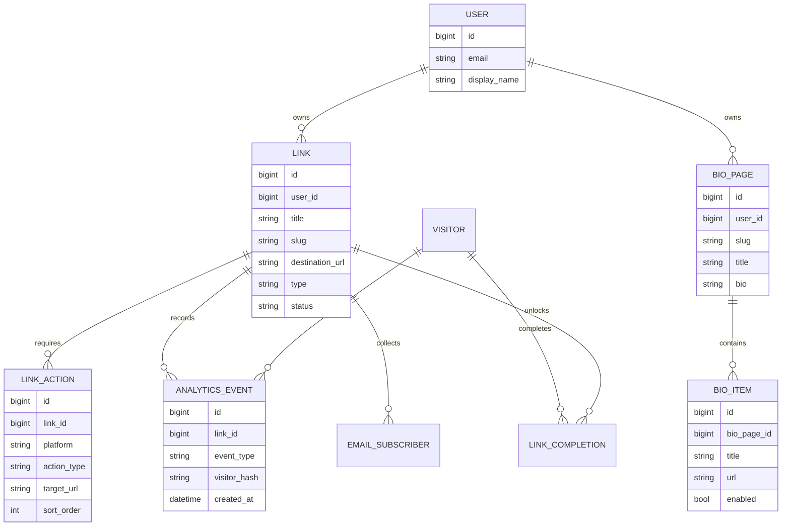

# Data Model Inference

## Entity Diagram

Status: Recommended for rebuild

## Proposed Entities

Status: Recommended

- User: creator account.
- Link: gated/direct/email-capture link.
- LinkAction: ordered social actions.
- LinkVisitor: anonymized visitor identity.
- LinkCompletion: visitor completion/unlock record.
- EmailSubscriber: captured email for a link.
- BioPage and BioItem: link-in-bio profile and links.
- AnalyticsEvent: view, action, unlock, click.

## Reference Certainty

Status: Inferred

The public UI implies links, actions, visitors/completions, analytics events, and email subscribers. The real database schema is unknown.
