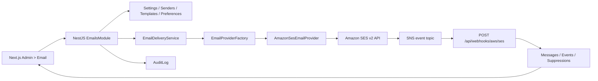

# Email Operations Center

## Scope

`/admin/emails` is the operational surface for transactional and future opt-in marketing email. Phase 1 includes provider health, sender identities, templates and immutable versions, preference-topic taxonomy, message activity, test sends, audit logs, and the Amazon SES event webhook.

It intentionally does **not** include campaigns, audience building, scheduled or mass sending, A/B tests, automation workflows, contact import, CSV export, or automatic DNS provisioning.

## Architecture



Business services depend on the `EmailProvider` interface, not the AWS SDK. Resend or Postmark can be added as another adapter and registered in `EmailProviderFactory` without changing template, sender, preference, or delivery policies.

The current repository uses Prisma with SQLite for development. Database names are explicitly mapped to snake_case, and the models/indexes are portable to the project's eventual production database subject to normal Prisma provider migration work.

## Environment variables

Configure these only in the API deployment environment:

```dotenv
AWS_REGION=ap-southeast-1
AWS_ACCESS_KEY_ID=
AWS_SECRET_ACCESS_KEY=
AWS_SES_SNS_TOPIC_ARNS=arn:aws:sns:ap-southeast-1:123456789012:ses-events
EMAIL_DEBUG_MODE=false
```

- Credentials are never stored in Prisma, returned by an API, rendered in the admin UI, or written to logs.
- `AWS_SES_SNS_TOPIC_ARNS` is a comma-separated allowlist. Leave it empty only during controlled local setup; production should pin the exact topic ARN.
- `EMAIL_DEBUG_MODE=true` allows raw provider event JSON in activity detail for users who already have `emails.logs.read`. Keep it disabled by default because event payloads can contain delivery metadata.

## Amazon SES console setup

1. In the selected AWS region, move the SES account out of sandbox if real recipients are required. This is an infrastructure step, not an admin UI action.
2. Create the configuration sets named exactly `transactional` and `marketing`.
3. Create an SNS topic for SES events and subscribe the public HTTPS endpoint:
   `https://<api-host>/api/webhooks/aws/ses`.
4. Enable the event types required by the activity model: send, delivery, bounce, complaint, reject, rendering failure, open, and click. Open/click require compatible configuration-set tracking.
5. Put the SNS topic ARN in `AWS_SES_SNS_TOPIC_ARNS` and restart the API.
6. Give the API IAM principal only the required SES actions: account/configuration-set reads, identity create/read, and email send. SNS subscription confirmation is performed through the signed AWS URL; the app does not provision topics.
7. In Admin > Email > Settings, run **Check connection**. An incomplete configuration returns a friendly status; raw AWS exceptions are not exposed.

## Sender DNS setup

Create sender identities from Admin > Email > Senders. The wizard returns the SES DKIM CNAME records for manual copy into Route53, Cloudflare, or another DNS provider.

- Use a dedicated subdomain such as `notify.example.com` for transactional mail.
- Marketing senders must use a subdomain, preferably `news.example.com`.
- Add the DKIM records shown by SES, a suitable SPF policy, and DMARC for the organizational domain.
- Configure a custom MAIL FROM domain in SES when required by the deployment's alignment policy.
- The application does not write DNS records automatically.
- Only a verified identity can become the default sender. A default or referenced sender cannot be disabled or deleted until a replacement is selected and templates are reassigned.

## REST API

All paths below are under `/api`. Admin routes use the existing JWT and database-backed permission guards.

| Method | Path | Permission |
| --- | --- | --- |
| GET | `/admin/emails/overview` | `emails.read` |
| GET/PATCH | `/admin/emails/settings` | `emails.read` / `emails.settings.update` |
| POST | `/admin/emails/settings/check-connection` | `emails.settings.update` |
| GET/POST | `/admin/emails/senders` | `emails.read` / `emails.senders.manage` |
| GET/PATCH/DELETE | `/admin/emails/senders/:id` | `emails.read` / `emails.senders.manage` |
| POST | `/admin/emails/senders/:id/check-verification` | `emails.senders.manage` |
| POST | `/admin/emails/senders/:id/set-default` | `emails.senders.manage` |
| GET/POST | `/admin/emails/templates` | `emails.templates.read` / `emails.templates.create` |
| GET/PATCH/DELETE | `/admin/emails/templates/:id` | template read/update/delete permission |
| POST | `/admin/emails/templates/:id/preview` | `emails.templates.read` |
| POST | `/admin/emails/templates/:id/test-send` | `emails.test.send` |
| GET | `/admin/emails/templates/:id/versions` | `emails.templates.read` |
| POST | `/admin/emails/templates/:id/restore-version/:version` | `emails.templates.update` |
| GET/POST/PATCH | `/admin/emails/preference-topics[/:id]` | `emails.read` / `emails.preferences.manage` |
| GET | `/admin/emails/activity` | `emails.logs.read` |
| GET | `/admin/emails/activity/:id` | `emails.logs.read` |
| POST | `/webhooks/aws/ses` | Public; mandatory SNS signature, trusted-host, topic, timestamp, and idempotency validation |

## Data and lifecycle rules

- Templates use `{{variable.path}}`; every used variable must exist in the schema. Active templates require examples for required variables.
- HTML is sanitized server-side with an email-safe allowlist. Plain text is generated only when omitted.
- Publishing creates an immutable version snapshot. Restore creates a new version. Sent templates are archived instead of hard deleted.
- Test sends create `email_messages` and lifecycle events with type `test`.
- Transactional pause blocks new transactional test/delivery calls; no emergency override exists in phase 1.
- Marketing eligibility requires a healthy enabled flow, verified sender, active user, enabled optional topic, explicit opt-in, and no local suppression.
- Permanent bounce and complaint events upsert a local suppression record.
- Provider event idempotency is enforced by `(provider_event_id, event_type)`.
- Metrics are computed only from persisted messages/events. An empty database returns “Chưa đủ dữ liệu” rather than fabricated chart points.

## Seeded records

- Templates: `verify_email`, `password_reset`, `payout_completed`, `new_feature_announcement` (draft).
- Preference topics: `account_security`, `payments_and_payouts`, `product_updates`, `promotions`, `weekly_digest`.
- Ten email permissions from the permission catalog are assigned through the existing role/permission seeding flow.

## Phase 2 extension points

`email_messages.campaign_id`, message category/tags, topic opt-in records, provider adapters, immutable template snapshots, suppressions, and event storage are already shaped for campaigns. Phase 2 should add separate campaign/audience/schedule/queue modules and reference these records; it should not put campaign state into templates or settings.
