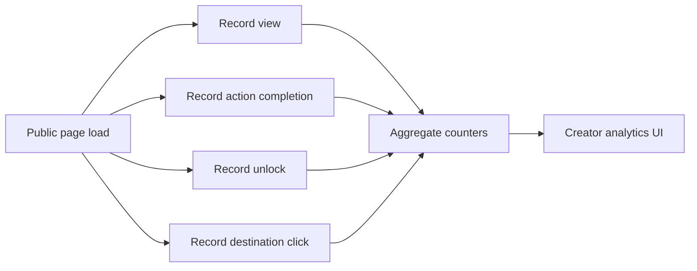

# Free Analytics

## Publicly Visible Analytics Claims

Status: Observed

The homepage advertises analytics with labels such as views, unlocks, conversion rate, real-time audience intelligence, traffic sources, device data, and link performance. A public mockup shows `Unlocks`, `Views`, and `Conversion`.

After scrolling the lazy-loaded homepage, the mock analytics section showed sample values including `Unlocks 8,234`, `Views 12,453`, and `Conversion 66.1%`. These are marketing/demo values, not verified creator-account analytics.

Evidence:

- `evidence/screenshots/public/homepage-desktop.png`
- `evidence/screenshots/public/homepage-desktop-lazy-after-scroll.png`
- `evidence/notes/homepage-desktop-lazy-after-scroll.json`
- `evidence/notes/public-homepage-desktop.json`

## Authenticated Analytics

Status: Observed

Authenticated `/dashboard/analytics` shows:

- Date ranges: 7 days, 30 days, 6 months, 1 year.
- Metrics: Unlocks, Actions completed, Views, Conversion rate, Emails captured.
- Quick Insights: traffic country, source, device, top performer.
- Top Links list.
- Some analytics details are marked with upgrade prompts and were not opened.

Audience page `/dashboard/audience` shows activity, top links, source, country, city, device, browser, and platform.

Evidence:

- `evidence/screenshots/analytics/auth-07-dashboard-analytics.png`
- `evidence/screenshots/dashboard/auth-08-dashboard-audience.png`
- `evidence/network/analytics/auth-07-dashboard-analytics.json`
- `evidence/network/links/auth-08-dashboard-audience.json`

## Recommended Free Metrics

Status: Recommended

- Total views
- Unique visitors
- Unlocks
- Conversion rate
- Action completion counts
- Link clicks
- Date range filter
- Referrer
- Country
- Device class
- Browser/OS when available

## Analytics Event Flow

Status: Recommended

