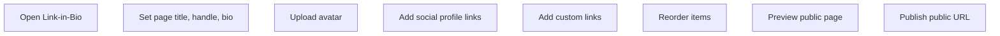

# Link In Bio

## Reference Observation

Status: Observed dashboard inventory

The homepage contains a "LINK-IN-BIO" feature section. Authenticated dashboard includes `/dashboard/link-in-bio`, showing an existing page entry, Create action, page title, views, and delete control. The full builder flow was not opened to avoid modifying existing bio data.

Evidence:

- `evidence/screenshots/public/homepage-desktop.png`
- `evidence/screenshots/link-in-bio/auth-03-dashboard-link-in-bio.png`
- `evidence/notes/public-homepage-desktop.json`

## Recommended Free Rebuild Scope

Status: Recommended

Include:

- Username/slug
- Profile title and biography
- Avatar
- Social profile links
- Custom links with title, URL, enabled state, ordering
- Preview and public URL

Do not include premium-only appearance controls unless later verified as free.

## Unknowns

Status: Unknown

- Public URL format
- Free customization options
- Link ordering UI
- Deletion/disabling behavior
- Analytics for bio items
