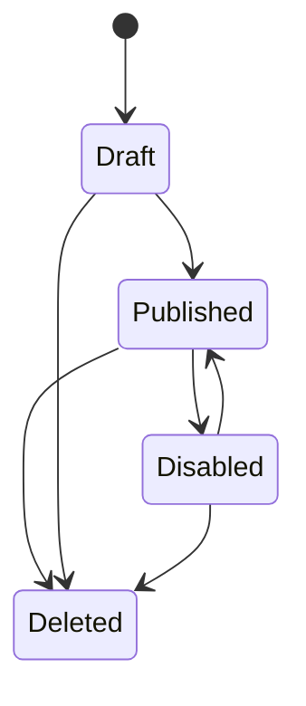

# Link Management

## Authenticated Link List

Status: Observed

The authenticated link list is at `/dashboard/links`. It shows dashboard navigation, a Create link entry, a Shortened links tab, selectable rows, edit actions, title/type/status/count/date columns, row overflow menu, and pagination.

Evidence:

- `evidence/screenshots/dashboard/authenticated-home.png`
- `evidence/screenshots/dashboard/auth-links-after-create-attempts.png`
- `evidence/notes/authenticated-run-summary.json`

## Recommended Free Rebuild Scope

Status: Recommended

Include a creator-side link list with:

- Search
- Type filter
- Status filter
- Cards or table rows
- Link title
- Public URL
- Type
- Created date
- Views
- Unlocks/completions
- Copy link
- Preview
- Edit
- Enable/disable
- Delete with confirmation

## Lifecycle

Status: Recommended

Destructive actions should only apply to creator-owned links and should use soft deletion.
