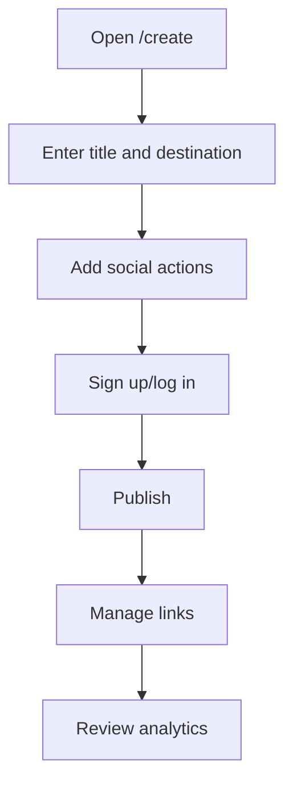

# Project Blueprint

## Product Summary

Status: Observed

Build an independent creator link platform where creators publish links that unlock after visitor actions. Public evidence shows social-action gated links, direct destination URLs, email capture marketing, analytics marketing, and link-in-bio marketing. Authenticated evidence confirms dashboard navigation, URL social-gated link creation, analytics/audience pages, files, email lists, settings, and link-in-bio inventory.

## Target Users

Status: Inferred

Creators, streamers, community owners, musicians, educators, and digital-product makers who trade access to content for follows, subscribes, joins, clicks, or email signups.

## Main Use Cases

Status: Recommended

- Gate a download or URL behind social actions.
- Share a clean public unlock page.
- Grow subscribers/followers/community members.
- Track free analytics.
- Maintain a link-in-bio profile.
- Capture emails during unlock.

## Free Feature Inventory

Status: Observed and inferred

- Observed: public create form, social action demos, lazy-loaded after-scroll demo states, invalid public link page, auth forms, password reset form, authenticated dashboard navigation, link list, URL social-gated link creation, file/snippet create toggles, link-in-bio list, analytics, audience, files, email lists, settings, public visitor flow for a created link.
- Inferred: full email capture visitor submission behavior and social completion verification.
- Unknown: exact free limits, full edit/delete behavior, file upload publishing, snippet entity publishing, and link-in-bio builder internals.

## Supported Link Types

Status: Recommended

- Social-action gated destination link.
- Direct destination link.
- Email-capture gated link.
- Link-in-bio page.
- File/download gated link if uploads are included in free scope.

## Creator Journey Summary

Status: Observed

## Visitor Journey Summary

Status: Partly observed

Visitor opens a public slug, sees required actions and locked progress. In the created test link, clicking Subscribe opened YouTube in a new tab, disabled the action button on return, but did not unlock within the observation window. Invalid slugs show an inactive-link page.

## Main Modules

Status: Recommended

Authentication, User Profile, Link Management, Link Types, Social Actions, Link-in-Bio, Public Link Rendering, Visitor Completion, Email Capture, Analytics, Moderation, Settings.

## Proposed Architecture

Status: Recommended

Laravel, MySQL, Redis, Laravel Queue, scheduled jobs, object storage for uploads, Blade with Alpine.js or Vue, REST endpoints for public unlock and dashboard, Cloudflare for delivery and protection.

## Proposed Data Model

Status: Recommended

Core entities: User, Link, LinkAction, LinkVisitor, LinkCompletion, EmailSubscriber, BioPage, BioItem, AnalyticsEvent.

## Design-System Summary

Status: Measured

The reference uses Inter, dark background, bright green CTAs, large bold hero type, pill CTAs, and dark creator-focused surfaces. The rebuild should use an original palette and brand while preserving clarity and conversion-oriented layouts.

## Security Requirements

Status: Recommended

Validate URLs, prevent open redirects, escape/sanitize content, enforce CSRF and rate limits, authorize ownership, sign public action state, dedupe completions and analytics, validate email, block malicious domains, provide reporting and audit logs, and use soft deletion.

## Analytics Requirements

Status: Recommended

Track views, unique visitors, action completions, unlocks, clicks, conversion rate, referrer, country, device, browser/OS, and date ranges.

## Implementation Order

Status: Recommended

1. Auth/profile.
2. Link CRUD and public inactive page.
3. Social action gated flow.
4. Analytics events and dashboard.
5. Link management.
6. Email capture.
7. Link-in-bio.
8. Moderation/security hardening.

## Risks And Unknowns

Status: Unknown

Full visitor unlock persistence, social verification, file/snippet publishing, email capture submission, link-in-bio builder internals, and test-link cleanup remain partially unverified.

## Supporting Documents

- [PRODUCT_OVERVIEW.md](PRODUCT_OVERVIEW.md)
- [SITEMAP.md](SITEMAP.md)
- [PAGE_INVENTORY.md](PAGE_INVENTORY.md)
- [LINK_TYPE_INVENTORY.md](LINK_TYPE_INVENTORY.md)
- [CREATE_LINK_FLOWS.md](CREATE_LINK_FLOWS.md)
- [SOCIAL_ACTIONS.md](SOCIAL_ACTIONS.md)
- [LINK_IN_BIO.md](LINK_IN_BIO.md)
- [VISITOR_UNLOCK_FLOW.md](VISITOR_UNLOCK_FLOW.md)
- [LINK_MANAGEMENT.md](LINK_MANAGEMENT.md)
- [AUTHENTICATION.md](AUTHENTICATION.md)
- [FREE_ANALYTICS.md](FREE_ANALYTICS.md)
- [DESIGN_SYSTEM.md](DESIGN_SYSTEM.md)
- [RESPONSIVE_BEHAVIOR.md](RESPONSIVE_BEHAVIOR.md)
- [OBSERVED_API.md](OBSERVED_API.md)
- [DATA_MODEL_INFERENCE.md](DATA_MODEL_INFERENCE.md)
- [PROPOSED_ARCHITECTURE.md](PROPOSED_ARCHITECTURE.md)
- [REBUILD_PLAN.md](REBUILD_PLAN.md)
- [ACCEPTANCE_CRITERIA.md](ACCEPTANCE_CRITERIA.md)
- [RISKS_AND_UNKNOWNS.md](RISKS_AND_UNKNOWNS.md)
