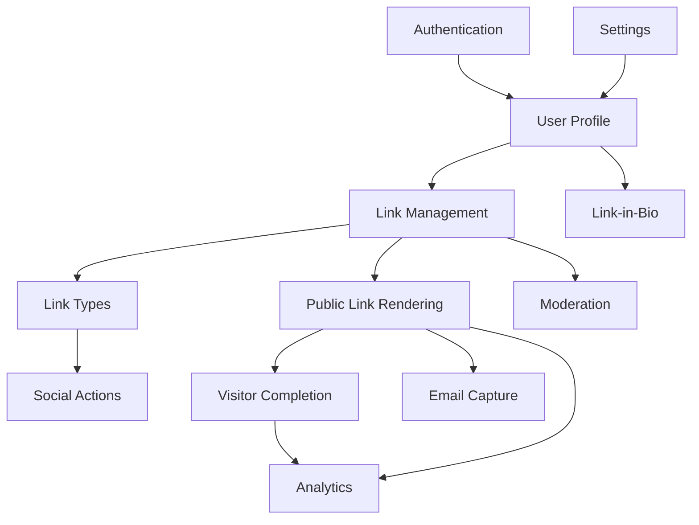

# Proposed Architecture

## Stack

Status: Recommended

- Laravel application
- MySQL relational database
- Redis for cache, rate limits, short-lived visitor state, and queues
- Laravel Queue for analytics aggregation and email workflows
- Scheduled jobs for analytics rollups, cleanup, and moderation checks
- Object storage for avatars and file downloads when uploads are included
- Blade with Alpine.js or Vue for creator dashboard and public unlock interactions
- REST API for dashboard AJAX and public unlock events
- Cloudflare for CDN, WAF, bot controls, and caching static assets

## Module Diagram

Status: Recommended

## Security Requirements

Status: Recommended

- Strict URL validation and protocol allowlist.
- Open redirect prevention with signed destination redirects.
- XSS prevention through escaping and sanitized rich text.
- CSRF protection on creator mutations.
- Rate limiting on auth, public unlock, email capture, and link creation.
- Bot and abuse mitigation through Cloudflare and app-side throttles.
- Link ownership authorization on all edit/delete/read analytics operations.
- Signed public action tokens.
- Duplicate completion detection by visitor hash, link, and action.
- Analytics deduplication windows.
- Email validation and consent storage.
- Domain blocking and malicious destination scanning.
- Link report system and moderation queue.
- Audit logs for creator mutations.
- Soft deletion and data retention policies.

## Explicitly Excluded Modules

Status: Required

No subscription, billing, payment, pricing, checkout, or premium entitlement module.
