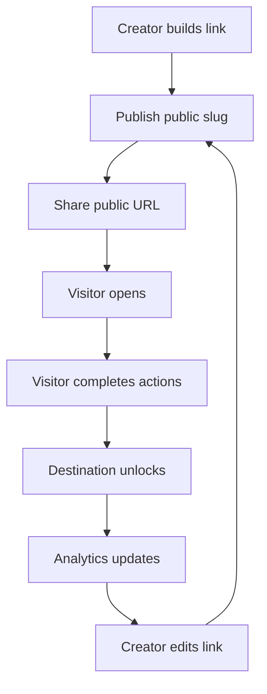

# Rebuild Plan

## Implementation Order

Status: Recommended

1. Authentication and creator profile.
2. Link CRUD with direct destination URLs.
3. Public link rendering and inactive-link page.
4. Social action configuration and visitor completion.
5. Analytics event collection and basic dashboard metrics.
6. Link management list with edit, disable, delete, copy, preview.
7. Email capture link behavior.
8. Link-in-bio builder and public pages.
9. Moderation/reporting and abuse controls.
10. Responsive polish and accessibility pass.

## Flow Coverage

Status: Recommended

## Test Plan

Status: Recommended

- Unit tests for URL validation and ownership policies.
- Feature tests for create/edit/delete link.
- Browser tests for public unlock and mobile layouts.
- Queue tests for analytics aggregation.
- Security tests for XSS, CSRF, open redirect, and rate limit behavior.
