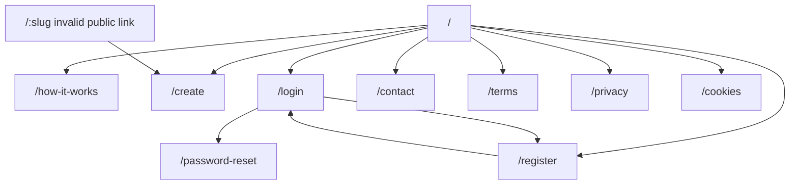
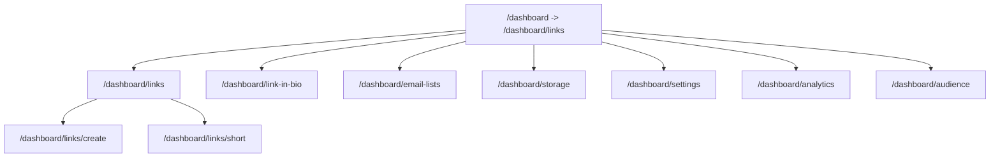

# Sitemap

## Public Sitemap

Status: Observed

Evidence:

- `evidence/notes/research-summary.json`
- `evidence/notes/public-homepage-desktop.json`
- `evidence/notes/authentication-login.json`
- `evidence/notes/interaction-create-public.json`

## Authenticated Dashboard Sitemap

Status: Observed

Authenticated navigation exposed these free-account routes. Upgrade prompts were visible but were not followed.

Evidence:

- `evidence/screenshots/dashboard/authenticated-home.png`
- `evidence/notes/authenticated-run-summary.json`
