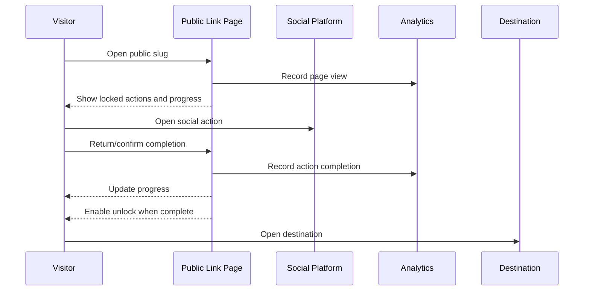

# Visitor Unlock Flow

## Invalid Or Removed Link

Status: Observed

Opening a nonexistent slug shows a public inactive-link page:

- Message: "This link is no longer active"
- Explanation: "The creator may have removed or moved this content."
- Action: "Create your own link"
- Network: `GET /social-unlocks/{slug}` returns 404 JSON.

Evidence:

- `evidence/screenshots/visitor-flow/invalid-public-link.png`
- `evidence/network/links/interaction-create-public.json`

## Expected Gated Visitor Flow

Status: Partly observed, partly inferred

## Observed Public Demo States

Status: Observed

- Locked button state.
- Progress text like `0/5 done` and `0/4 done`.
- After-scroll lazy/demo state with checked actions, `4/4 done`, and `lock_open Unlock file`.
- Multiple action labels before unlock.
- Viewer account is not advertised as required.

Evidence:

- `evidence/screenshots/public/homepage-desktop.png`
- `evidence/screenshots/public/homepage-desktop-lazy-after-scroll.png`
- `evidence/screenshots/mobile/homepage-mobile-390.png`

## Created Link Visitor Test

Status: Observed

- Public URL: `https://rekonise.com/codex-url-demo-1783760537194-j2r4b`
- Mobile visitor page showed title, one Subscribe to channel action, progress `0/1`, and disabled Unlock link.
- Clicking the Subscribe action opened YouTube in a new tab.
- After returning, the action button was disabled, but progress still showed `0/1` and Unlock remained disabled during the observation window.
- The page logged traffic through `POST /traffic/log`.
- Free/public link page showed ads/branding-related surfaces; upgrade flow was not explored.

Evidence:

- `evidence/screenshots/visitor-flow/created-url-mobile-initial.png`
- `evidence/screenshots/visitor-flow/created-url-mobile-after-action-click.png`
- `evidence/network/visitor-flow/created-url-mobile-initial.json`
- `evidence/notes/post-create-extra-summary.json`

## Unknowns

Status: Unknown

- Whether action completion persists after refresh.
- Whether cookies or local storage are used.
- Whether destination URL is exposed before completion.
- Whether social actions open in new tabs.
- Whether completion is verified or trust-based.
