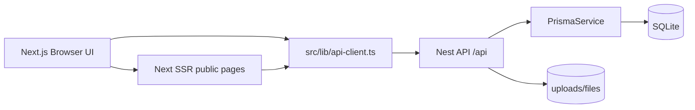

# Current Architecture

## High-Level Shape

Status: Observed.

## Frontend

Status: Observed.

The frontend is App Router based. All dashboard views are directly accessible and wrapped with `DashboardShell`; there is no route middleware.

Main shell/nav:

- Sidebar and topbar live in `src/components/dashboard/shell.tsx`.
- Mobile bottom nav lives in `src/components/dashboard/mobile-bottom-nav.tsx`.
- Topbar user dropdown is hard-coded and includes non-wired menu items.

Evidence:

- `src/components/dashboard/shell.tsx:45-75`
- `src/components/dashboard/shell.tsx:230-289`
- `src/components/dashboard/mobile-bottom-nav.tsx:15-75`

## API Client Layer

Status: Observed.

`src/lib/api-client.ts` is the only central API client found. It calls the Nest API directly using `fetch`.

Findings:

- No auth header, cookie handling, CSRF token, or tenant/user identifier is sent.
- API response shapes are typed in TypeScript but not runtime-validated.
- Client assumes API base URL from `NEXT_PUBLIC_API_URL` or `http://localhost:4000/api`.

Evidence:

- `src/lib/api-client.ts:1-3`
- `src/lib/api-client.ts:161-199`
- `src/lib/api-client.ts:237-340`

## Backend

Status: Observed.

Backend is a minimal Nest API:

- `LinksModule`
- `FilesModule`
- `BioPagesModule`
- global `PrismaModule`

No modules were found for auth, users, analytics events, social completion, moderation, report handling, queue, cache, scheduler, events/listeners, or repositories.

Evidence:

- `backend/src/app.module.ts`
- `backend/src/main.ts:14-24`
- Search result: no `@UseGuards`, `CanActivate`, `ScheduleModule`, `Queue`, `CacheModule`, `OnEvent`, or repository layer in app source.

## Validation

Status: Partial.

Backend uses global Nest `ValidationPipe` with whitelist, transform, and forbidNonWhitelisted.

Evidence:

- `backend/src/main.ts:19-24`

DTO validation exists for:

- Create link: `backend/src/links/dto/create-link.dto.ts`
- Create bio page: `backend/src/bio-pages/dto/create-bio-page.dto.ts`
- Update file: `backend/src/files/dto/update-file.dto.ts`

Gaps:

- No URL allow/block policy.
- No platform/action enum enforcement for link actions.
- No slug length/pattern validation in `CreateLinkDto.customAlias`.
- File upload validates only presence and 100 MB size limit at Multer layer; no MIME allowlist.
- Expiry fields are stored but not enforced in public link route/API.

## Authorization

Status: Not implemented.

No auth middleware or guard was found. Database models also do not contain owner/user fields. All list and mutation endpoints are effectively global in the current implementation.

Evidence:

- `backend/src/links/links.controller.ts:10-22`
- `backend/src/files/files.controller.ts:32-80`
- `backend/src/bio-pages/bio-pages.controller.ts:10-27`
- `prisma/schema.prisma:10-94`

## Error Handling and Logging

Status: Partial.

Nest default exception handling is used. Services throw `BadRequestException`, `ConflictException`, and `NotFoundException` in selected cases. There is no custom exception filter, structured app logger, request ID, or frontend error boundary found.

Evidence:

- `backend/src/links/links.service.ts:1-6`
- `backend/src/files/files.service.ts:1-5`
- `backend/src/bio-pages/bio-pages.service.ts:1-6`

## FE-First Assessment

Status: Inferred.

This architecture is acceptable as a local FE prototype if the Nest API is treated as disposable mock persistence. The biggest near-term FE stabilization need is to make `npm run build` pass, isolate mock data, and decide which screens are real flows versus static previews.

