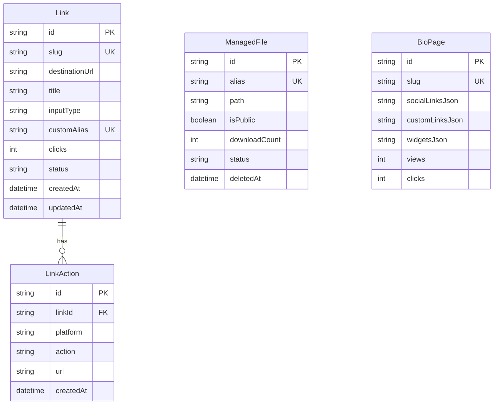

# Current Database

## Datasource

Status: Observed.

Prisma uses SQLite.

Evidence:

- `prisma/schema.prisma:5-8`

## Models

Status: Observed.

## Link

Status: Partial.

`Link` supports basic social gated link metadata, actions, background settings, expiry fields, click count, and status.

Evidence:

- `prisma/schema.prisma:10-39`
- `backend/src/links/links.service.ts:25-63`

Gaps:

- No `userId` / owner relation.
- No normalized visitor/completion/event tables.
- `clicks`, `status`, `expiryEnabled`, `expiryType`, `expiryDate`, `maxClicks` are stored but not enforced or updated by public `/l/[slug]`.
- `selectedFile` stores a string instead of FK to `ManagedFile`.
- `inputType`, `status`, `expiryType`, platform/action are plain strings, not enum constraints.

## LinkAction

Status: Partial.

`LinkAction` is normalized and cascades with `Link`.

Evidence:

- `prisma/schema.prisma:41-50`

Gaps:

- No ordering column.
- No required/optional marker.
- No verification/completion data.
- No platform-specific schema.

## ManagedFile

Status: Partial.

`ManagedFile` stores local upload metadata and soft deletion.

Evidence:

- `prisma/schema.prisma:53-72`
- `backend/src/files/files.service.ts:58-75`
- `backend/src/files/files.service.ts:143-153`

Gaps:

- No owner relation.
- `isPublic` is not enforced on download; `download()` only checks `deletedAt`.
- Physical files are not deleted on soft delete.
- Local disk path is stored directly.
- No MIME allowlist or virus scanning model.

## BioPage

Status: Partial.

`BioPage` stores page config and aggregates `views`/`clicks`.

Evidence:

- `prisma/schema.prisma:74-94`
- `backend/src/bio-pages/bio-pages.service.ts:24-39`

Gaps:

- No owner relation.
- Nested links/socials/widgets are JSON strings, not relational rows.
- No edit/delete endpoints.
- No per-link analytics.
- Views increment on every `GET /bio-pages/:slug`; no dedupe or bot filtering.

## Migrations

Status: Observed.

Migrations exist for:

- initial Link/LinkAction tables.
- ManagedFile.
- BioPage.

Evidence:

- `prisma/migrations/20260531094955_init/migration.sql`
- `prisma/migrations/20260705000000_add_managed_files/migration.sql`
- `prisma/migrations/20260705010000_add_bio_pages/migration.sql`

## FE-First Database Note

Status: Recommended.

For FE-only development, current SQLite/mock persistence can remain. To avoid confusing prototype with product, label these tables as “mock persistence” until authentication, ownership, and event tracking are intentionally designed.

