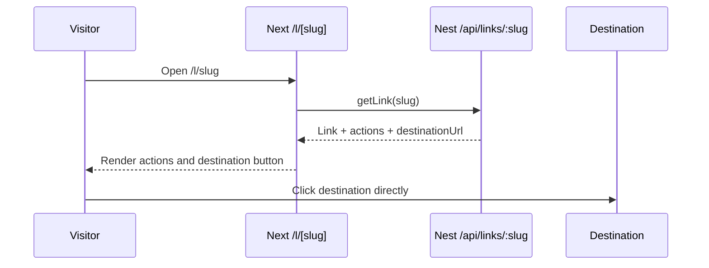

# User Journey Status

Legend: Working, Partial, Broken, Mocked, Missing, Unknown.

## Summary Table

| Journey | Status | Evidence |
| --- | --- | --- |
| 1. Đăng ký | Missing | No auth/user routes, no login/register pages found; no `User` model in `prisma/schema.prisma:10-94`. |
| 2. Đăng nhập và đăng xuất | Mocked | Dashboard user dropdown shows static profile and logout item with no handler: `src/components/dashboard/shell.tsx:230-289`. |
| 3. Creator tạo link | Partial | FE form calls `createLink`: `src/app/create/demo.tsx:899-919`; backend `POST /links`: `backend/src/links/links.controller.ts:10-12`. |
| 4. Creator chỉnh sửa link | Missing | Link card shows Edit item but no handler/API: `src/components/dashboard/views/link-card.tsx:288-360`; backend has no PATCH link route. |
| 5. Creator bật/tắt/xóa link | Missing | UI shows Deactivate/Delete items without handlers; backend has no PATCH/DELETE link route. |
| 6. Visitor mở public link | Partial | `/l/[slug]` fetches link and renders action/destination: `src/app/l/[slug]/page.tsx:16-72`. |
| 7. Redirect đến destination | Partial | Public page uses normal external anchor; no redirect endpoint, no click tracking: `src/app/l/[slug]/page.tsx:64-72`. |
| 8. Social-action gated link | Mocked | Creator can configure actions; public page does not gate destination: `src/app/l/[slug]/page.tsx:47-72`. |
| 9. Visitor hoàn thành social action | Missing | No completion endpoint/model; public actions are outbound anchors only. |
| 10. Visitor unlock destination | Broken | Destination button is visible before action completion: `src/app/l/[slug]/page.tsx:64-72`. |
| 11. Tracking lượt truy cập | Partial | Bio pages increment views/clicks; link clicks not incremented: `backend/src/bio-pages/bio-pages.service.ts:65-102`; `Link.clicks` not updated in link service. |
| 12. Creator xem analytics | Mocked | Link stats modal hard-coded zero/demo values; bio analytics combines real aggregate counters with hard-coded source rows. |
| 13. Link-in-bio | Partial | Create/list/public render exist; no edit/delete; build currently fails in this area. |
| 14. Email capture | Missing | Email capture section is commented out: `src/app/create/demo.tsx:1699-1710`; no backend model. |
| 15. Report và moderation | Missing | No report/moderation routes/models/services found. |

## Flow Diagrams

### Current Link Creation

```mermaid
flowchart TD
  A[/links or /create] --> B[SocialLinksGenerator]
  B --> C[Client-side validation]
  C --> D[POST /api/links]
  D --> E[Prisma Link + LinkAction]
  E --> F[Show /l/slug success]
```

Status: Partial.

Main gap: no auth/owner and no edit lifecycle.

### Current Visitor Link Flow



Status: Broken.

### Current Link-in-Bio Flow

```mermaid
flowchart TD
  A[/bio] --> B[Load GET /api/bio-pages]
  A --> C[Create tab]
  C --> D[POST /api/bio-pages]
  D --> E[BioPage JSON fields]
  E --> F[/b/slug public page]
  F --> G[GET /api/bio-pages/slug increments views]
  F --> H[POST /api/bio-pages/slug/click increments clicks]
```

Status: Partial.

## FE-First Notes

Status: Recommended.

For frontend development, prioritize journeys 3, 6, 8, 10, and 13 as interactive vertical slices. Keep auth, analytics, report/moderation, payout/referral/levels as clearly labeled mock until backend scope is reopened.
